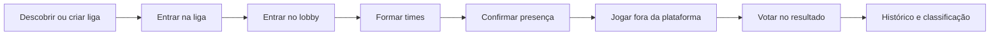

# Handoff de produto e UI/UX

Este diretório descreve a experiência atual do **Ligas** para apoiar pesquisa, arquitetura de informação, wireframes e uma futura proposta visual. A documentação registra o comportamento existente; não é um pedido para preservar a interface atual.

## Como usar este material

Leitura recomendada para iniciar o redesign:

1. [Visão do produto e jornadas](user-flows.md) — quem usa, por quê e como os principais fluxos se conectam.
2. [Inventário de telas](screens.md) — conteúdo, ações, variações e estados de cada rota.
3. [Regras de negócio e permissões](business-rules.md) — restrições que a experiência precisa comunicar.
4. [Estados, feedback e conteúdo](interaction-states.md) — loading, vazio, erro, realtime, confirmação e linguagem.

## Escopo do produto

O Ligas organiza partidas 5x5 de League of Legends entre amigos. Ele administra a competição social ao redor da partida — liga, membros, lobby, times, ready check, votação, histórico e classificação — mas não executa a partida nem importa automaticamente seu resultado.



## Princípios que não devem se perder no redesign

- A próxima ação do usuário deve ser evidente.
- Permissões e impedimentos devem ser explicados, não apenas representados por botões desabilitados.
- Estados alterados por outras pessoas precisam aparecer sem exigir atualização manual.
- Voto individual é privado; apenas os totais são coletivos.
- A hierarquia da liga e o alcance de cada ação administrativa devem estar claros.
- A experiência precisa funcionar sem conta Riot vinculada.
- A interface deve prever loading, vazio, erro, sessão expirada, acesso negado e reconexão.
- Ações destrutivas ou irreversíveis precisam de confirmação proporcional ao risco.

## Perfis envolvidos

| Perfil | Objetivo principal | Acesso característico |
| --- | --- | --- |
| Visitante | Entender o produto e criar uma conta | Landing, login e cadastro |
| Jogador autenticado | Encontrar ligas, participar de lobbies e acompanhar resultados | Toda a área pessoal |
| Membro da liga | Participar da comunidade e das partidas | Conteúdo interno da liga e lobby |
| Admin da liga | Organizar membros, solicitações, lobbies e disputas | Gestão da liga, exceto ações exclusivas do owner |
| Owner da liga | Governar a liga | Tudo que o admin faz, transferência de ownership e exclusão |
| Operador da plataforma | Investigar usuários e ligas com projeções seguras | Área isolada `/ops`, somente leitura na interface atual |

`player` e `spec` são papéis de membro. O papel `spec` está abaixo de `player` na hierarquia administrativa, mas ambos contam como membros da liga. As limitações efetivas aparecem em [regras de negócio](business-rules.md).

## Mapa de navegação

```mermaid
flowchart TD
    Landing[Landing /] --> Login[/login]
    Landing --> Register[/register]
    Login --> Forgot[/forgot-password]
    Forgot --> Reset[/reset-password]
    Login --> Home[Início /main]
    Register --> Home

    Home --> Leagues[Ligas /leagues]
    Home --> Match[Detalhe da partida /matches/:id]
    Leagues --> League[Liga /leagues/:id]
    League --> Settings[Configurações /leagues/:id/settings]
    League --> Lobby[Lobby /leagues/:leagueId/lobbies/:lobbyId]
    Lobby --> Match

    Home --> Players[Jogadores /players]
    Players --> PublicProfile[Perfil público /players/:userId]
    Home --> Invitations[Convites /invitations]
    Home --> Profile[Meu perfil /profile]

    Home --> Ops[Operações /ops]
    Ops --> OpsUser[Usuário /ops/users/:userId]
    Ops --> OpsLeague[Liga /ops/leagues/:leagueId]
```

## Navegação autenticada atual

A navegação principal contém **Início**, **Ligas**, **Jogadores**, **Convites** e **Perfil**. **Operações** aparece apenas para contas autorizadas. Configurações, lobby, partida e perfis públicos são rotas contextuais acessadas a partir de outras telas.

## Fonte e atualização deste documento

Este handoff foi levantado a partir das rotas, páginas, componentes, tipos, serviços e regras do backend existentes em agosto de 2026. Quando uma regra de produto mudar, atualize primeiro `business-rules.md` e depois as jornadas/telas afetadas.

Documentação técnica relacionada: [arquitetura e realtime](../frontend-session-query-realtime.md), [contrato de erros](../error-contract.md) e [ADRs](../adr).
