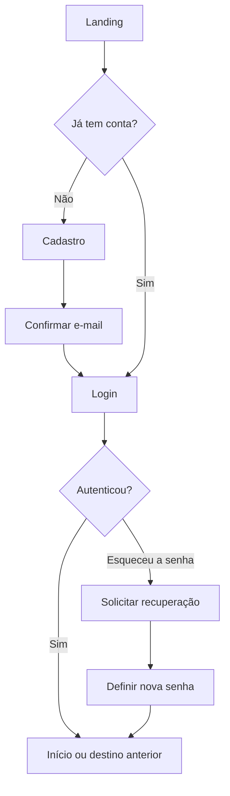
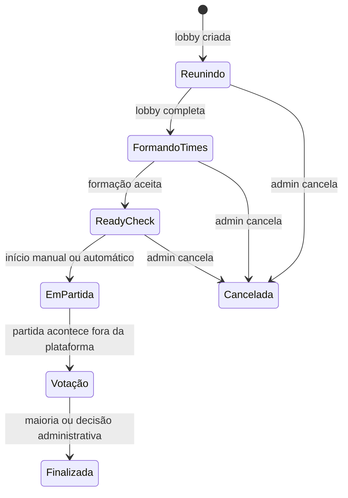

# Visão do produto e jornadas

## 1. Entrada e autenticação

### Visitante conhece o produto

1. Acessa a landing.
2. Entende a proposta, benefícios e o fluxo liga → lobby → resultado.
3. Escolhe entrar ou criar uma conta.

### Criar conta

1. Informa e-mail, senha e confirmação de senha.
2. A senha precisa ter ao menos 10 caracteres.
3. Após o cadastro, recebe orientação para confirmar o e-mail.
4. Confirma no provedor e volta para entrar.
5. No primeiro acesso, o backend cria/inicializa o perfil.
6. Um onboarding apresenta atalhos para criar liga, descobrir ligas e completar o perfil.

### Entrar

1. Informa e-mail e senha.
2. Em caso de sucesso, segue para o destino originalmente solicitado ou para `/main`.
3. Credenciais inválidas, e-mail não confirmado e falha genérica possuem mensagens distintas.
4. Se a sessão expirar durante o uso, a pessoa é direcionada para a tela de sessão expirada e pode autenticar novamente.

### Recuperar senha

1. Na tela de login, seleciona **Esqueci minha senha**.
2. Informa o e-mail.
3. A confirmação não revela se a conta existe.
4. Abre o link recebido e define uma senha nova.
5. Após o sucesso, continua para a aplicação.

## 2. Primeira experiência autenticada

O dashboard funciona como central de atividade. Ele apresenta:

- próximos passos: lobby aguardando, votação pendente ou solicitações para administrar;
- totais de ligas, partidas, vitórias e derrotas;
- ligas recentes;
- partidas recentes e seu resultado.

Se a pessoa ainda não participa de nenhuma liga, o estado vazio prioriza duas escolhas: **criar uma liga** ou **explorar ligas**.

## 3. Criar e configurar uma liga

### Criação

1. Abre o diálogo **Criar liga**.
2. Define nome, descrição, visibilidade, política de entrada e limite de membros.
3. Ao criar, torna-se owner automaticamente.
4. A nova liga passa a aparecer em **Minhas ligas**.

### Configuração posterior

Owner e admin podem editar:

- nome e descrição;
- avatar e banner por URL;
- visibilidade pública ou privada;
- entrada aberta, por solicitação ou apenas por convite;
- limite de membros;
- quem pode criar lobby: apenas administração ou qualquer membro;
- início automático quando todos os requisitos forem atendidos.

Somente o owner vê a zona de exclusão da liga. Excluir é permanente para a experiência do usuário e remove os dados dependentes por cascata.

## 4. Encontrar e entrar em uma liga

Em **Ligas**, a pessoa vê duas coleções: ligas das quais já participa e ligas disponíveis para descoberta. A busca possui debounce e os resultados públicos têm paginação por **Carregar mais**.

### Entrada aberta

1. Abre uma liga pública.
2. Seleciona **Entrar na liga**.
3. Se houver vaga, torna-se membro imediatamente.

### Entrada por solicitação

1. Abre uma liga pública.
2. Seleciona **Solicitar entrada**.
3. Um owner/admin visualiza a solicitação no overview da liga.
4. A administração aprova ou rejeita.
5. Se aprovada e ainda houver vaga, a pessoa vira membro.

### Entrada por convite

1. Um owner/admin encontra um jogador e envia um convite.
2. O destinatário vê o convite em **Convites**.
3. Pode aceitar ou rejeitar.
4. Ao aceitar, entra na liga se o convite ainda for válido e houver vaga.

### Liga privada

Não aparece na descoberta pública. O acesso acontece por contexto autorizado, vínculo existente ou convite.

## 5. Administrar uma liga

Owner/admin usa a página da liga para:

- revisar e decidir solicitações pendentes;
- convidar jogadores quando a política é `invite_only`;
- criar lobby conforme a política configurada;
- alterar papéis de membros abaixo de sua própria hierarquia;
- remover membros abaixo de sua hierarquia;
- abrir as configurações;
- resolver uma votação de partida ainda aberta, com justificativa.

O owner é único. Promover outra pessoa a owner transfere a propriedade e rebaixa o owner anterior para admin. O owner atual não pode sair nem ser removido antes dessa transferência.

## 6. Preparar uma partida no lobby

### Entrada no lobby

1. Um membro abre uma lobby ativa da liga. A interface de criação aceita uma quantidade par entre 2 e 10, com 10 como padrão para o formato 5x5.
2. Se ainda não participa dela e há vaga, seleciona **Entrar**.
3. Enquanto a lobby está em `waiting`, pode sair, trocar de time e alternar ready/unready.
4. Owner/admin pode cancelar a lobby em espera.

### Fases percebidas

Na implementação, `Em partida` e `Votação` compartilham o status `in_game`: assim que a partida começa, a interface disponibiliza a votação do resultado.

### Escolha do método de formação

Em uma lobby 5x5 cheia, participantes votam em um dos modos. A formação avançada existe apenas para 10 jogadores e exige 6 votos.

- **Aleatório:** o sistema distribui os times; participantes aceitam ou pedem novo sorteio por maioria.
- **Balanceado:** o sistema forma times balanceados e conclui a etapa automaticamente.
- **Escolha por jogadores:** participantes elegem capitães dentro do prazo; os capitães alternam escolhas até completar os times.

Durante a formação, ready e troca manual de time ficam bloqueados. A interface deve deixar claro quem pode agir, de quem é a vez, o total necessário e o tempo restante.

### Condições para começar

A lobby só começa quando:

- está cheia;
- os times estão equilibrados;
- a formação de times foi concluída, quando disponível;
- todos os participantes estão prontos;
- o status ainda é `waiting`.

Se **início automático** estiver ativado em uma lobby de 10 jogadores, o servidor inicia quando todas as condições forem satisfeitas. Em lobbies menores, ou quando a opção estiver desligada, owner/admin aciona **Iniciar partida**.

## 7. Registrar o resultado

1. Ao iniciar a partida, o sistema cria um snapshot dos participantes e seus times.
2. Cada participante vota no time vencedor.
3. O voto individual não é exibido aos demais; os totais por time são visíveis.
4. O participante pode mudar o voto enquanto a votação está aberta.
5. Quando um time alcança maioria absoluta, a partida é finalizada automaticamente.
6. Sem maioria, a votação permanece aberta.
7. Owner/admin pode atribuir a vitória a um time antes da finalização, mas deve escrever uma justificativa com pelo menos cinco caracteres.
8. Após finalizar, a interface oferece detalhe da partida, classificação e retorno à liga.

Não existe correção administrativa depois que a partida foi finalizada.

## 8. Acompanhar competição e identidade

### Página da liga

A liga possui cinco abas preservadas na URL:

- **Visão geral:** papel atual, quantidade de membros, próxima ação, solicitações e convite quando aplicável.
- **Classificação:** posição, partidas, vitórias, derrotas, aproveitamento, forma recente e sequência.
- **Partidas:** histórico paginado.
- **Lobbies:** lobbies da liga e criação/entrada quando permitida.
- **Membros:** lista, papéis e ações administrativas.

### Perfil próprio

A pessoa visualiza suas estatísticas, ligas públicas e partidas recentes. Pode editar nickname, avatar e banner por URL. A conta Riot é opcional e só apresenta controles de vínculo se a integração estiver configurada no ambiente.

### Descoberta de jogadores

É possível buscar por nickname, carregar mais resultados e abrir um perfil público. O resultado informa ligas públicas e quantidade de ligas públicas em comum. E-mail nunca aparece no perfil público.

### Detalhe da partida

Mostra status, liga, data, os dois times, vencedor, placar de votos e método de decisão. Quando houve resolução administrativa, exibe a justificativa.

## 9. Operações da plataforma

Uma conta com papel global autorizado vê **Operações** na navegação. A área atual é investigativa e somente leitura:

- buscar usuários por nickname ou UUID;
- buscar ligas por nome, UUID ou owner;
- consultar status, datas e contagens;
- abrir detalhes de memberships, solicitações, convites, lobbies e partidas recentes.

Owner/admin de liga não recebe acesso operacional global. Falta de permissão leva a `/forbidden`.
