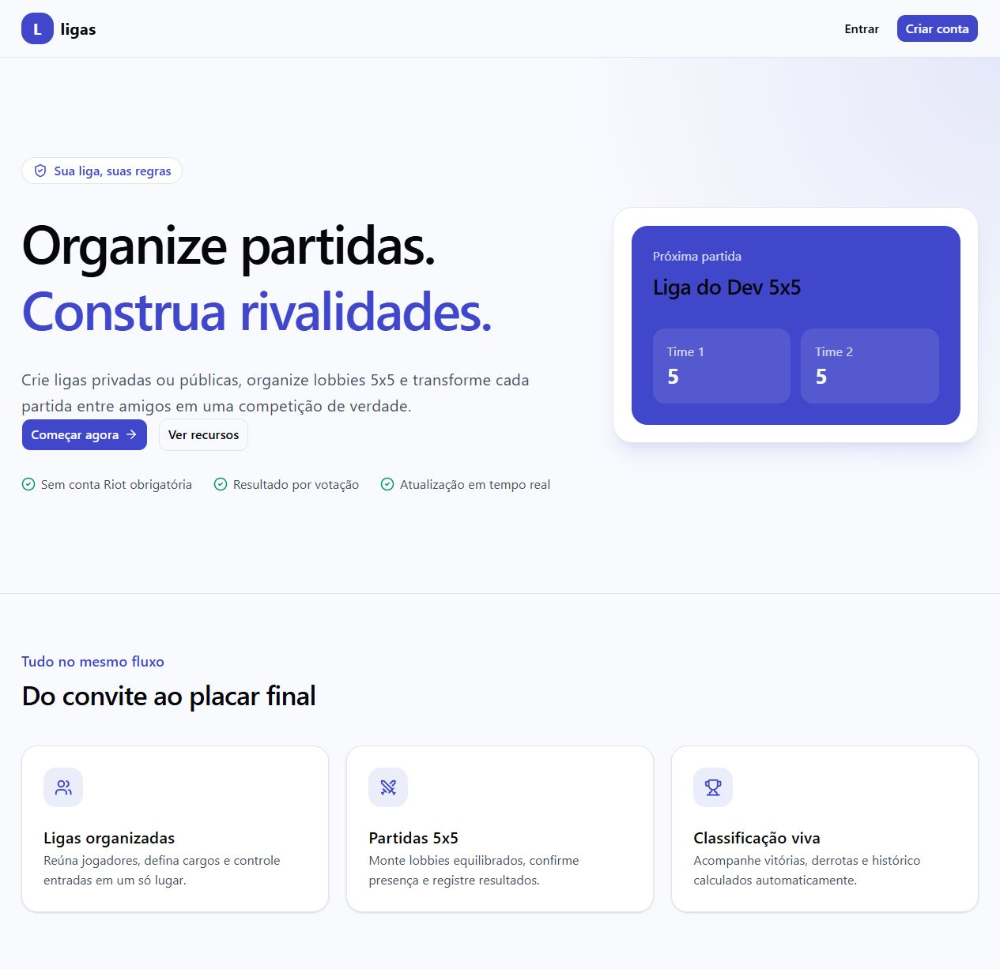
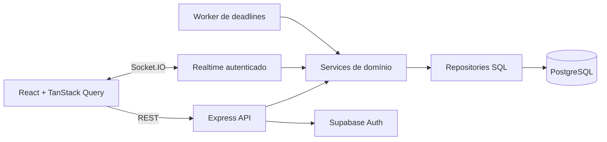

# Ligas

[](https://github.com/Mariani5472/site_league_tournaments/actions/workflows/api-tests.yml)
[](https://github.com/Mariani5472/site_league_tournaments/actions/workflows/database-schema.yml)

Plataforma full stack para organizar partidas 5x5 de League of Legends entre amigos — da criação da liga à classificação final.

O projeto cobre entrada de participantes, formação de times, ready check, eleição de capitães, votação do resultado, histórico e ranking. A partida acontece fora da plataforma, por isso os fluxos principais não dependem da API da Riot.

> **Status:** projeto concluído e mantido como peça de portfólio. O escopo atual representa a versão final planejada; novas funcionalidades não fazem parte do roadmap.

[Visão geral](#visão-geral) · [Decisões técnicas](#decisões-técnicas) · [Executar localmente](#executando-localmente) · [Documentação](#documentação)



## Visão geral

O Ligas nasceu para resolver um problema comum em grupos que jogam juntos: organizar participantes, montar dois times equilibrados e manter um histórico confiável sem depender de planilhas ou mensagens dispersas.

O fluxo principal é:

1. criar ou entrar em uma liga;
2. reunir dez jogadores em uma lobby;
3. definir os times e confirmar a presença;
4. realizar a partida;
5. votar no resultado;
6. atualizar automaticamente histórico e classificação.

Além da experiência do jogador, o sistema inclui ferramentas administrativas, observabilidade, auditoria e cuidados de operação que aproximam o projeto de um produto real.

## Funcionalidades

- Cadastro, login, recuperação de senha e sessão com Supabase Auth.
- Ligas públicas, moderadas por solicitação ou restritas a convites.
- Papéis de owner, admin e membro, com transferência segura de propriedade.
- Lobbies 5x5 em tempo real, ready check e formação de times.
- Eleição de capitães e draft com prazo controlado pelo servidor.
- Votação do resultado por maioria e resolução administrativa de disputas.
- Histórico de partidas e classificação calculada a partir dos resultados finalizados.
- Perfis públicos e vínculo opcional com uma conta Riot.
- Painel operacional para consulta segura de usuários, ligas e trilha de auditoria.
- Interface responsiva, tema claro/escuro e conteúdo em português e inglês.

## O que este projeto demonstra

- Desenvolvimento de uma aplicação full stack com TypeScript de ponta a ponta.
- Modelagem de domínio para permissões, estados de lobby, votação e ranking.
- Concorrência tratada com transações e locks no PostgreSQL.
- Comunicação em tempo real sem abrir mão de uma fonte de verdade canônica.
- Autenticação, autorização por recurso, rate limiting e validação de entrada.
- Evolução segura de banco por migrations e verificação automatizada de schema.
- Testes de integração com PostgreSQL, Express e clientes Socket.IO reais.
- Preparação operacional com health checks, métricas, logs estruturados e graceful shutdown.
- CI para testes, build, schema e processo de release em staging.

## Decisões técnicas

### REST como fonte da verdade, Socket.IO como sinalização

O estado canônico é obtido pela API REST. Eventos Socket.IO autenticados avisam o cliente de que um recurso mudou, e o TanStack Query busca novamente os dados. Essa separação evita manter duas representações concorrentes do estado e simplifica reconexões.

### Regras críticas protegidas no banco

Operações como ocupar a última vaga, aprovar uma entrada, iniciar a partida, registrar o snapshot dos jogadores e finalizar uma votação são transacionais. Locks e constraints preservam as invariantes mesmo quando duas requisições chegam ao mesmo tempo.

### Histórico como base da classificação

O ranking é derivado dos snapshots das partidas finalizadas, em vez de depender de contadores acumulados. Assim, histórico e classificação não precisam ser reconciliados. A decisão está registrada no [ADR de classificação](docs/adr/0005-standings-source-of-truth.md).

### Camadas com responsabilidades explícitas

Na API, controllers tratam transporte, services concentram autorização e regras de negócio, e repositories executam SQL parametrizado. Essa organização mantém o domínio testável e reduz o acoplamento com Express e PostgreSQL.

## Arquitetura



## Tecnologias

| Área | Tecnologias |
| --- | --- |
| Frontend | React 19, TypeScript, Vite, React Router, TanStack Query, Tailwind CSS e shadcn/ui |
| Backend | Node.js, Express 5, TypeScript, Socket.IO, Zod e Pino |
| Dados e autenticação | PostgreSQL, SQL manual, node-pg-migrate e Supabase Auth |
| Qualidade | Node Test Runner, Vitest, Testing Library, ESLint e Prettier |
| Infraestrutura | Docker Compose, GitHub Actions, Render e Adminer |

## Qualidade e operação

O repositório possui testes de domínio, contratos HTTP e transporte realtime, além de testes de componentes e fluxos no frontend. A CI executa a API com PostgreSQL real e também verifica se as migrations produzem o mesmo schema da baseline.

Outros cuidados implementados:

- endpoints separados de liveness e readiness;
- métricas protegidas e de baixa cardinalidade;
- correlation ID e logs estruturados sem credenciais;
- limites de requisição em HTTP e Socket.IO;
- pool PostgreSQL com capacidade e timeouts explícitos;
- validação de payloads e contrato consistente de erros;
- encerramento gracioso da API, conexões e worker;
- budget automatizado para o JavaScript inicial do frontend.

## Executando localmente

### Pré-requisitos

- Docker Desktop com Docker Compose;
- um projeto Supabase para autenticação.

### Passos

1. Copie `api/.env.example` para `api/.env`.
2. Copie `web/.env.example` para `web/.env`.
3. Preencha a URL e a chave publicável do Supabase nos dois arquivos.
4. Suba os serviços:

   ```bash
   docker compose up --build
   ```

5. Em outro terminal, aplique as migrations:

   ```bash
   docker compose exec api npm run migrate:up
   ```

6. Acesse:

   - aplicação: [http://localhost:5173](http://localhost:5173)
   - API: [http://localhost:3000](http://localhost:3000)
   - Adminer: [http://localhost:8080](http://localhost:8080)

Credenciais da Riot não são necessárias. A integração é opcional e só é habilitada quando `RIOT_API_KEY` e `RIOT_REGION` estão configuradas.

> O `docker-compose.yml` é exclusivo para desenvolvimento. Ele força a API a utilizar o PostgreSQL local, mesmo que exista outra `DATABASE_URL` em `api/.env`.

### Comandos de verificação

```bash
# API
cd api
npm run typecheck
npm run build
npm run test:integration

# Frontend
cd web
npm run lint
npm run test
npm run build
```

Os testes de integração limpam as tabelas entre cenários. Execute-os somente em um banco PostgreSQL isolado e descartável, nunca no banco local de trabalho ou em produção.

## Documentação

As decisões e rotinas de engenharia permanecem documentadas para quem quiser explorar o projeto em profundidade:

- [Decisões arquiteturais](docs/adr)
- [Handoff de produto e fluxos para UI/UX](docs/product/README.md)
- [Migrations e evolução do schema](docs/migrations.md)
- [Contrato de erros](docs/error-contract.md)
- [Sessão, cache e realtime no frontend](docs/frontend-session-query-realtime.md)
- [Observabilidade](docs/observability.md)
- [Segurança e operação da plataforma](docs/platform-ops-security.md)
- [Release e rollback](docs/release-and-rollback.md)
- [Estratégia de instância única para realtime](docs/single-instance-realtime.md)

## Limitações conhecidas

- A partida acontece fora do sistema; não há captura automática do resultado pelo cliente do jogo.
- A integração Riot é apenas um metadado opcional do perfil.
- Uma partida finalizada não possui correção administrativa posterior.
- A arquitetura realtime atual opera deliberadamente em uma única instância. Escala horizontal exige um adapter compartilhado e revisão da estratégia de rooms.
- A autenticação completa depende de um projeto Supabase configurado.

## Contexto do projeto

Este é um projeto autoral desenvolvido para consolidar conhecimentos de arquitetura full stack, modelagem de domínio, concorrência em banco de dados, realtime, segurança, testes e operação. Mais do que entregar telas, o objetivo foi construir um fluxo consistente do navegador ao banco e registrar as decisões que sustentam essa consistência.

O projeto está encerrado no escopo atual e permanece disponível como estudo de caso e item de portfólio.
